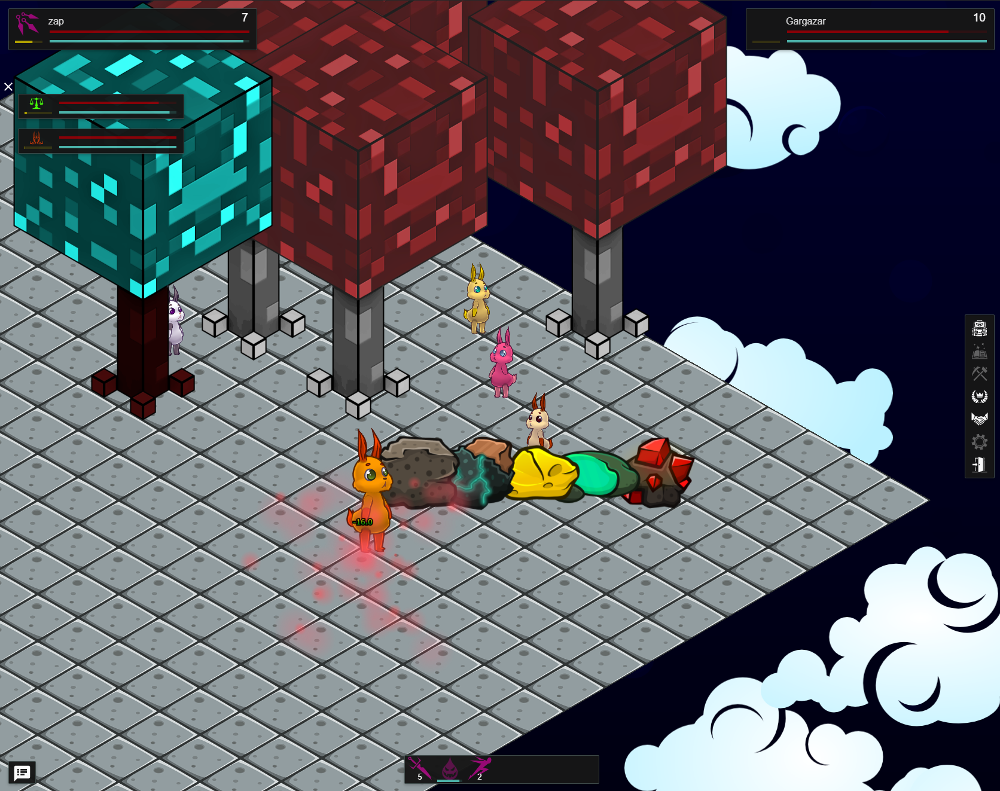

# Mutable Bunnies - Game Client

Browser based game client for the Mutable Bunnies game server. [Mutable Bunnies - Server](https://github.com/codingchili/mutable-bunnies-server)



Sample in-game image of a simple test world, first [demo video](https://www.youtube.com/watch?v=TlFcvCJb9lw) now available!

# Install & run

Until mutable-bunnies-server has a release available this repository should be cloned as a submodule to the 
mutable-bunnies-server project. See the instructions in the [repo](https://github.com/codingchili/mutable-bunnies-server)
on how to clone.

When cloned as a git submodule inside the server project, the server can be started with

```console
./gradlew :client:generate
./gradlew :client:run
```

This will run the backend server and the webserver to serve the game client.

The webserver can be configured in conf/service/web.yaml.

Example of the default configuration,

```yaml
---
node: "website.node"
startPage: "index.html"
missingPage: "404.html"
resources: "website/"
cache: false
gzip: false
global: "LSc7+5GuvEPkt80gTa9X6IdteHJ++aZWkBYsbWnvB1NpOEP6RcfW03qXNFj9HO4YAUX6JxohipZm51rReU553Q=="
logging:
  properties:
    type: "HmacSHA512"
  domain: "website.node"
  key: "+DPBfH6OGlvBvoLCKqlWZcj67apYCDBrQf1fZcllxW2xpwOB0VGqWHMCYnABgmZsS1NWNvk+6VOpQPfFbf5LKA=="
  expiry: 1599990680
listener:
  secure: true
  port: 443
```

See [conf/system/certificates/README.md](conf/system/certificates/README.md) for information on how to set up keystores
with `secure: true`. If keystore is unset then a test certificate is generated on the fly.